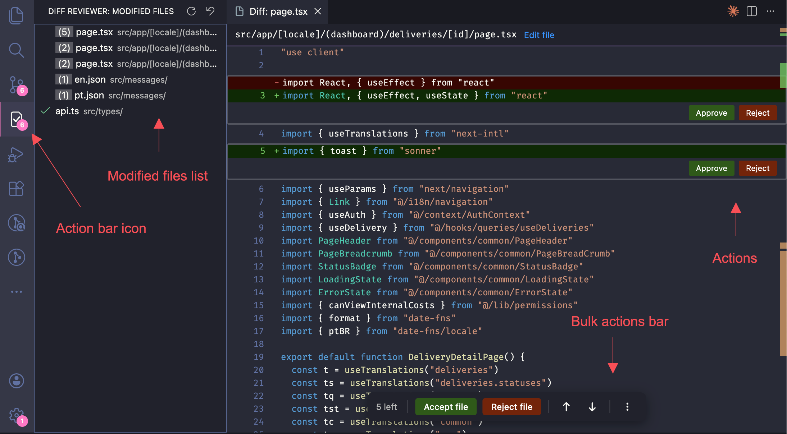

# Diff Reviewer

**Diff Reviewer** is a VS Code extension that brings an interactive, hunk-by-hunk review workflow directly into your editor. Browse your uncommitted changes in a sidebar, open any file to see its diff inline, and approve or reject individual change groups - all without leaving VS Code.

## Features

- **Sidebar file tree** - All files with uncommitted changes (staged + unstaged vs HEAD) listed in one place, including untracked new files
- **Inline diff view** - Full file content with change hunks highlighted at their exact line positions - no side-by-side pane switching
- **Per-hunk approve / reject** - Review each change group independently; rejecting a hunk reverse-applies it on disk immediately
- **Approve or reject an entire file** - One-click buttons in the sidebar context menu to bulk-approve or bulk-reject all hunks in a file
- **Undo everything** - Every approve and reject action is fully undoable
- **Stable hunk tracking** - Approvals are keyed by content, not line number, so they survive when other hunks shift position after edits
- **Syntax highlighting** - Server-side highlighting via highlight.js for accurate colorization
- **Theme-aware** - Seamlessly follows VS Code light and dark themes

## Requirements

- **Git** must be installed and available on your `PATH`
- **VS Code** v1.85 or later
- Open a folder that contains a Git repository

## Getting Started

1. Open a Git repository in VS Code
2. Click the **Diff Reviewer** icon in the Activity Bar (left sidebar)
3. The **Modified Files** panel lists all files with uncommitted changes
4. Click any file to open its inline diff view
5. Use the **Approve** and **Reject** buttons on each hunk to approve or reject it

## Usage

### Reviewing a file

Click a file in the **Modified Files** panel to open the diff view. Each changed region (hunk) is highlighted inline within the full file context. Use the action buttons on each hunk to:

- **Approve** - Mark the hunk as reviewed (no disk change)
- **Reject** - Reverse-apply the hunk on disk, removing those changes from your working tree

### Approving or rejecting an entire file

You can **Approve** (✓) or **Reject** (✗) an entire file directly from the sidebar. This applies the action to every pending hunk in the file at once.

### Undoing an approval

After approving a hunk, hover the mouse on top of the "APPROVED" label, it will turn into an "UNDO" button. WARNING: Rejected hunks can't be undone.

## Release Notes

See the full [CHANGELOG](CHANGELOG.md) for version history.